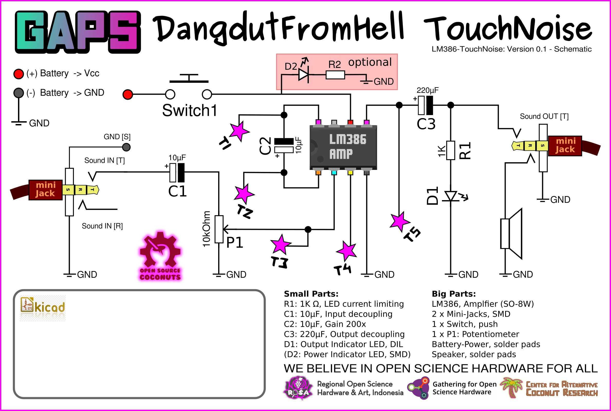
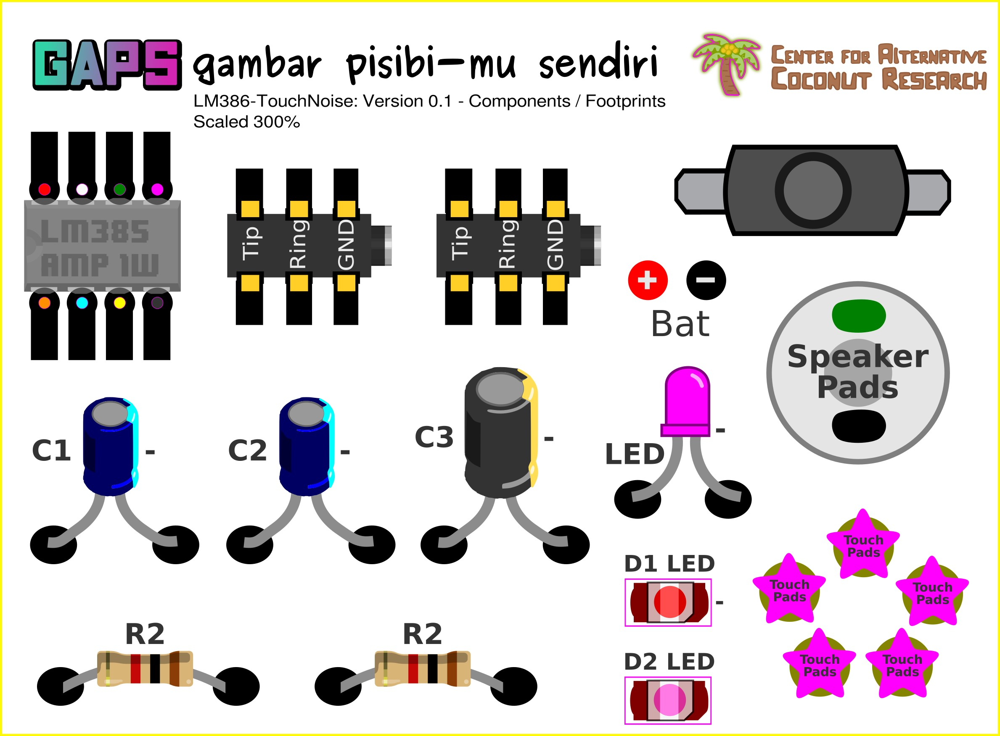

# GAPS-DangdutFromHell
New circuit and workshop handouts for making a touch-noise synthetizer, based on LM386

# diy-CAD Handouts
diy-CAD (do-it-yourself Children Aided Design): The core idea of the workshop-kit is tool for creative designs of printed circuit boards, introducing basic concepts of Open Hardware being something to re-design for your own use. 

Read more about the creative PCB design methodology on this wiki: https://www.hackteria.org/wiki/Diy-CAD

## the schematics

## the BOM also know as the parts

